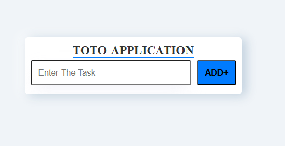

# TOTO APP -Simple Task Manager

Toto App Is a Simple Light Weight and easy-to-use task manager User Friendly Web Application. 

# Installation steps 
   1.Clone the Repository

   git clone https://github.com/chandrasekar007/React-Toto-Application.git

   2.Install Dependencies
 
   npm install

   3.Start the Application

   npm start
   

# ToTo App Features
   
    ToDo App helps users manage daily tasks easily. Below are the main features with clear descriptions:-

 1. Add Task

    Users can create new tasks by entering a task name . This helps them keep track of things they need to do.

 2. Edit Task
 
    If a user makes a mistake or wants to update a task, they can edit the existing task anytime.

 3. Mark Task as Completed

    Once a task is finished, users can mark it as completed. This helps them visually see what’s done and what’s pending.

 4. Delete Task

    Users can remove tasks they no longer need. This keeps the task list clean .

  

# Screenshots 

 Here is the Toto App Home Screen
 

  

  Here is the Toto App Adding Task Screen

  

  Here is the Toto App Editing Task Screen

 
 

